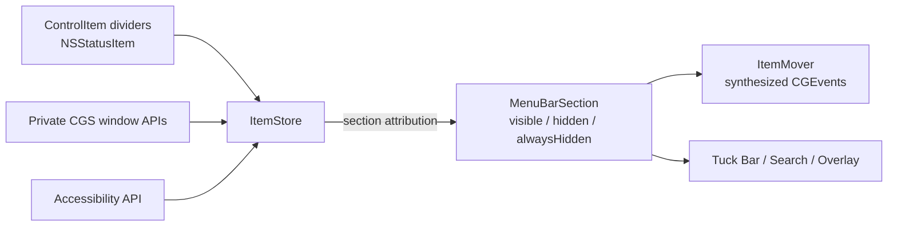

<div align="center">

# Tuck

**A native menu bar manager for macOS. Tuck away the clutter, bring it back when you need it.**

[](#requirements)
[](#tech-stack)
[](#architecture)
[](LICENSE)

[English](README.md) · [简体中文](README.zh-CN.md)

</div>

---

## Overview

Tuck splits your menu bar into three sections — **Visible**, **Hidden**, and **Always Hidden** — using lightweight divider items placed directly in the menu bar. Drag any status item across a divider to move it between sections, then reveal hidden items with a click, a hover, a scroll, a global hotkey, or a fuzzy search.

It runs as a menu-bar-only app with no Dock icon and a single Settings window.

## Features

| | |
|---|---|
| **Three sections** | Visible / Hidden / Always Hidden, separated by draggable dividers |
| **Reveal on demand** | Click, hover, or scroll on the menu bar to show hidden items |
| **Auto-rehide** | Smart, timed, or when the focused app changes |
| **Tuck Bar** | Show hidden items in a floating bar below the menu bar instead of in-line — anchored to the pointer, the Tuck icon, or chosen dynamically |
| **Search** | Fuzzy-match any menu bar item by name and activate it from the keyboard |
| **Global hotkeys** | Toggle sections, open search, enable Tuck Bar, show dividers, toggle application menus |
| **Layout editor** | Drag-and-drop arrangement of items across sections in Settings |
| **Appearance** | Custom menu bar shape, border, solid or gradient tint, shadow — with separate light/dark configs |
| **Item spacing** | Adjust the spacing between status items |
| **Hide app menus** | Collapse the active app's menus to reclaim space |
| **Custom icon** | Use your own image (template or full color) for the Tuck control item |
| **Launch at login** | Via `SMAppService`, no helper app |
| **Auto updates** | Sparkle, with optional automatic download |
| **Localized** | English and Simplified Chinese, switchable in-app |

## Requirements

- macOS 26.0 or later
- **Accessibility** permission — required. Used to read the menu bar layout and move items.
- **Screen Recording** permission — optional. Enables item thumbnails in Search, the Tuck Bar, and the layout editor.

Tuck is **not sandboxed**. It relies on private CoreGraphics Services APIs and synthesized events to manipulate other apps' status items; the App Sandbox would block this.

## Getting Started

```sh
git clone https://github.com/zerx-lab/Tuck.git
cd Tuck
open Tuck.xcodeproj
```

Select the `Tuck` scheme and run (⌘R). On first launch, the onboarding window walks you through granting Accessibility and (optionally) Screen Recording.

Sparkle is resolved automatically through Swift Package Manager.

Run the unit tests with ⌘U or:

```sh
xcodebuild test -scheme Tuck -destination 'platform=macOS'
```

## How It Works



1. Tuck places its own `NSStatusItem` dividers in the menu bar. They carry an accessibility identifier, so Tuck recognizes them without Screen Recording.
2. `ItemStore` enumerates every status item window across Spaces and attributes each one to a section purely by its x-position relative to the divider frames.
3. Hiding a section pushes its divider off-screen; showing it pulls the divider back. `ItemMover` repositions individual items by posting drag events through the owning process's event source.
4. `ScreenCapture` renders offscreen items into thumbnails for Search and the Tuck Bar when Screen Recording is granted.

## Architecture

```
Tuck/
├─ App/          TuckApp (@main), AppDelegate, AppState — central @Observable container
├─ MenuBar/      ControlItem, MenuBarManager, MenuBarSection, ApplicationMenu
├─ Items/        ItemStore, ItemMover, ScreenCapture, ItemImageCache, SpacingManager
├─ Bridging/     Swift wrappers + @_silgen_name shims for private CGS / AX symbols
├─ Events/       EventTap, EventMonitor, InteractionManager (click / hover / scroll)
├─ Hotkeys/      HotkeyCenter, HotkeyAction, KeyCombination, KeyCode, Modifiers
├─ Search/       FuzzyMatcher, SearchPanel, SearchView
├─ Bar/          TuckBarPanel, TuckBarView, TuckBarLocation
├─ Appearance/   AppearanceManager, AppearanceConfiguration, OverlayPanel, gradients
├─ Settings/     Settings facade, DefaultsKey, RehideStrategy, AppLanguage
├─ Permissions/  Accessibility / Screen Recording checks and onboarding UI
├─ Updates/      UpdatesManager (Sparkle)
├─ UI/           Settings panes, Layout editor, shared components
├─ Utilities/    Logging, extensions, timeouts, observation helpers
└─ Resources/    Localizable.xcstrings (en, zh-Hans)
```

`AppState` owns every manager and wires them together in `performSetup()` once permissions are granted. All state lives in `UserDefaults` under the keys listed in `Settings/DefaultsKey.swift`.

## Tech Stack

- Swift 5 with strict concurrency, `@MainActor` default isolation, `@Observable`
- SwiftUI for windows and panes; AppKit (`NSStatusItem`, `NSPanel`) for menu bar surfaces
- Swift Testing for unit tests (`TuckTests/`)
- [Sparkle](https://github.com/sparkle-project/Sparkle) 2.7+ for updates

## License

Tuck is released under the [GNU General Public License v3.0](LICENSE).
