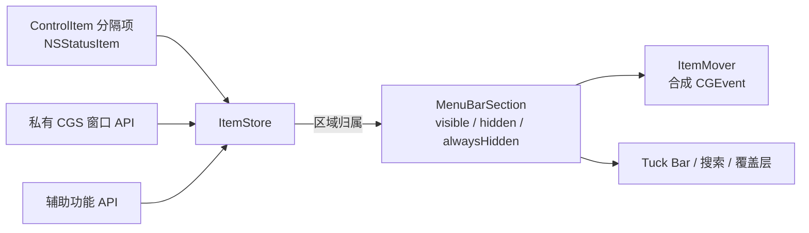

<div align="center">

# Tuck

**原生 macOS 菜单栏管理器。把杂乱收起来，需要时再拿出来。**

[](#系统要求)
[](#技术栈)
[](#架构)
[](LICENSE)

[English](README.md) · [简体中文](README.zh-CN.md)

</div>

---

## 简介

Tuck 通过放置在菜单栏中的轻量分隔项，把菜单栏划分为 **可见**、**隐藏**、**始终隐藏** 三个区域。拖动任意状态栏图标跨越分隔项即可在区域间移动；随后可以通过点击、悬停、滚动、全局快捷键或模糊搜索来唤出隐藏的图标。

Tuck 是纯菜单栏应用，没有 Dock 图标，只有一个设置窗口。

## 功能

| | |
|---|---|
| **三个区域** | 可见 / 隐藏 / 始终隐藏，由可拖动的分隔项划分 |
| **按需显示** | 在菜单栏上点击、悬停或滚动即可显示隐藏项 |
| **自动重新隐藏** | 智能判断、定时、或在前台应用切换时 |
| **Tuck Bar** | 在菜单栏下方的浮动栏中展示隐藏项——可锚定在鼠标指针、Tuck 图标处或动态定位 |
| **搜索** | 按名称模糊匹配任意菜单栏项，用键盘直接激活 |
| **全局快捷键** | 切换区域、打开搜索、启用 Tuck Bar、显示分隔项、切换应用菜单 |
| **布局编辑器** | 在设置中拖放排列各区域中的图标 |
| **外观** | 自定义菜单栏形状、边框、纯色或渐变着色、阴影，浅色/深色模式独立配置 |
| **图标间距** | 调整状态栏图标之间的间距 |
| **隐藏应用菜单** | 折叠当前应用的菜单以腾出空间 |
| **自定义图标** | 使用自己的图片（模板或彩色）作为 Tuck 控制图标 |
| **开机自启** | 基于 `SMAppService`，无需辅助程序 |
| **自动更新** | 基于 Sparkle，可选自动下载 |
| **本地化** | 英文与简体中文，可在应用内切换 |

## 系统要求

- macOS 26.0 及以上
- **辅助功能** 权限——必需。用于读取菜单栏布局并移动图标。
- **屏幕录制** 权限——可选。用于在搜索、Tuck Bar 和布局编辑器中显示图标缩略图。

Tuck **未启用沙盒**。它依赖 CoreGraphics Services 私有 API 与合成事件来操作其他应用的状态栏图标，App Sandbox 会阻止这些操作。

## 快速开始

```sh
git clone https://github.com/zerx-lab/Tuck.git
cd Tuck
open Tuck.xcodeproj
```

选择 `Tuck` scheme 并运行（⌘R）。首次启动时，引导窗口会协助你授予辅助功能权限以及（可选的）屏幕录制权限。

Sparkle 依赖通过 Swift Package Manager 自动解析。

运行单元测试：⌘U，或

```sh
xcodebuild test -scheme Tuck -destination 'platform=macOS'
```

## 工作原理



1. Tuck 在菜单栏中放置自己的 `NSStatusItem` 分隔项。它们带有辅助功能标识符，因此无需屏幕录制权限即可被识别。
2. `ItemStore` 枚举所有 Space 中的状态栏窗口，并仅依据其相对分隔项的 x 坐标判定归属区域。
3. 隐藏区域时，分隔项被推出屏幕外；显示时再拉回。`ItemMover` 通过向目标进程的事件源投递拖拽事件来移动单个图标。
4. 授予屏幕录制权限后，`ScreenCapture` 将屏幕外的图标渲染为缩略图，供搜索和 Tuck Bar 使用。

## 架构

```
Tuck/
├─ App/          TuckApp (@main)、AppDelegate、AppState —— 中央 @Observable 容器
├─ MenuBar/      ControlItem、MenuBarManager、MenuBarSection、ApplicationMenu
├─ Items/        ItemStore、ItemMover、ScreenCapture、ItemImageCache、SpacingManager
├─ Bridging/     Swift 封装 + 私有 CGS / AX 符号的 @_silgen_name 桥接
├─ Events/       EventTap、EventMonitor、InteractionManager（点击 / 悬停 / 滚动）
├─ Hotkeys/      HotkeyCenter、HotkeyAction、KeyCombination、KeyCode、Modifiers
├─ Search/       FuzzyMatcher、SearchPanel、SearchView
├─ Bar/          TuckBarPanel、TuckBarView、TuckBarLocation
├─ Appearance/   AppearanceManager、AppearanceConfiguration、OverlayPanel、渐变
├─ Settings/     Settings 门面、DefaultsKey、RehideStrategy、AppLanguage
├─ Permissions/  辅助功能 / 屏幕录制检测与引导界面
├─ Updates/      UpdatesManager（Sparkle）
├─ UI/           设置面板、布局编辑器、通用组件
├─ Utilities/    日志、扩展、超时、观察辅助
└─ Resources/    Localizable.xcstrings（en、zh-Hans）
```

`AppState` 持有所有管理器，并在权限授予后于 `performSetup()` 中完成装配。所有配置存储在 `UserDefaults` 中，键定义见 `Settings/DefaultsKey.swift`。

## 技术栈

- Swift 5，严格并发，默认 `@MainActor` 隔离，`@Observable`
- SwiftUI 负责窗口与设置面板；AppKit（`NSStatusItem`、`NSPanel`）负责菜单栏界面
- Swift Testing 单元测试（`TuckTests/`）
- [Sparkle](https://github.com/sparkle-project/Sparkle) 2.7+ 负责更新

## 许可证

Tuck 基于 [GNU General Public License v3.0](LICENSE) 发布。
